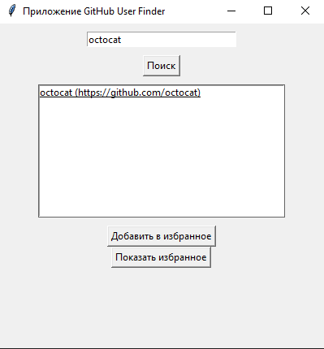
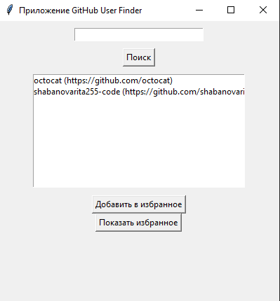

# Приложение GitHub User Finder

## Автор
Шабанова Маргарита

## Описание
GUI-приложение для поиска пользователей GitHub с использованием GitHub API.
Позволяет искать пользователей и добавлять их в избранное.

## Использование API
Используется GitHub REST API:
https://api.github.com/users/{username}

Пример:
https://api.github.com/users/octocat

## Функции
- Поиск пользователя
- Отображение результата
- Добавление в избранное
- Сохранение избранного в JSON

## Запуск
```bash
python main.py
```

## Скриншоты примеров использования

Поиск пользователя



Отображение избранного



